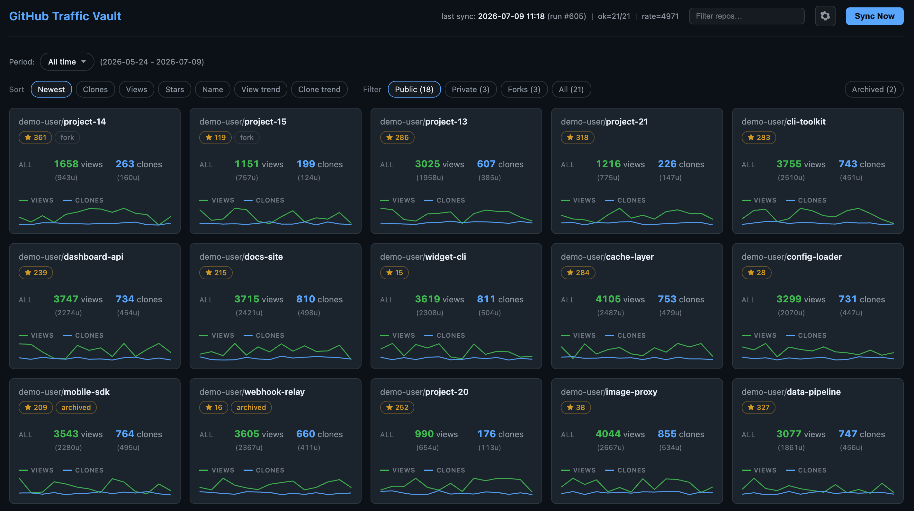
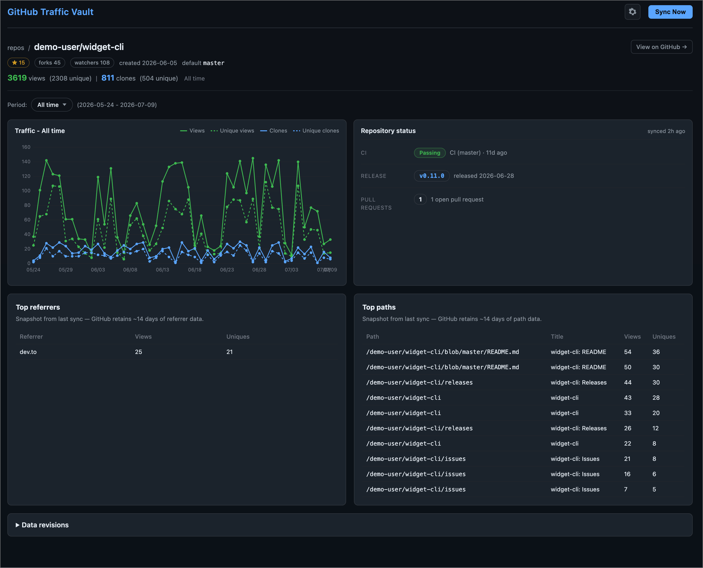
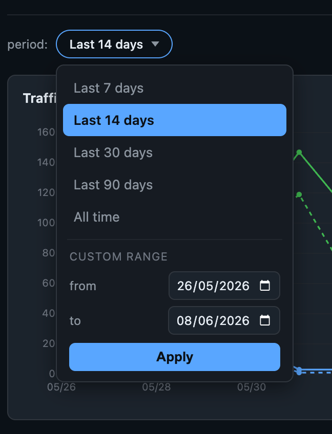

# GitHub Traffic Vault

> **Breaking change (v0.6+):** All configuration lives in **`config.yaml`** only. No `.env` file and no `GITHUB_TRAFFIC_VAULT_*` environment variables.
> Copy [`config.example.yaml`](config.example.yaml) to `config.yaml`, set `auth.github_token` (or rely on `gh auth token`), and for production set `auth.secret_key`.
> The settings UI writes display/sync/card options to `config.yaml`. Override the file path with `--config` on the CLI.

[](https://github.com/bulletinmybeard/github-traffic-vault/actions/workflows/ci.yml)
[](https://www.python.org/downloads/)
[](https://python-poetry.org/)
[](https://github.com/astral-sh/ruff)
[](https://github.com/python/mypy)
[](LICENSE)

GitHub only retains repository traffic data (views, clones, top referrers, top paths) for about 14 days. **GitHub Traffic Vault** permanently archives that data in SQLite for all of your public repos, so nothing ever gets lost.

<table>
  <tr valign="top">
    <td width="40%">
      <a href=".github/assets/github-traffic-vault-index-demo.png">
        
      </a>
    </td>
    <td width="40%">
      <a href=".github/assets/github-traffic-vault-detail-demo.png">
        
      </a>
    </td>
    <td width="20%">
      <a href=".github/assets/github-traffic-vault-date-picker.png">
        
      </a>
    </td>
  </tr>
  <tr>
    <td align="center"><em>All your repos at a glance</em></td>
    <td align="center"><em>Per-repo history and status</em></td>
    <td align="center"><em>Pick any time window</em></td>
  </tr>
</table>

## What it does

- **Archives traffic forever**: views, clones, top referrers, top paths — the stuff GitHub only keeps for ~14 days. Stored locally in SQLite, under your control
- **Syncs your public repos**: discovers everything you own, pulls fresh numbers, and remembers the history. Hit **Sync Now** in the browser or schedule `sync` from the terminal
- **Shows the big picture**: an index page with every repo as a card — totals for the period you pick, plus today. Defaults to the last 30 days
- **Drills into one repo**: daily chart, month-by-month breakdown, and a quick status glance (CI, latest release, open PRs)
- **Links a local git repository** (optional): on the detail page, point at a project directory under configured roots to see branch, dirty state, and whether git `origin` matches that GitHub repo
- **Flexible date ranges**: same picker on index and detail — this month, last month, last N months, all time, or a custom from/to range

You need a [GitHub personal access token](https://github.com/settings/tokens) with `repo` scope.

Copy `config.example.yaml` to `config.yaml` and set `auth.github_token`, or leave it empty and use `gh auth login` when the GitHub CLI is available.

Requires Python 3.12 and [Poetry](https://python-poetry.org/).

```bash
cp config.example.yaml config.yaml
# edit auth.github_token (and auth.secret_key for prod web UI)
poetry install
poetry run github-traffic-vault sync
```

## CLI

```bash
github-traffic-vault sync                          # discover + sync (cron entry point)
github-traffic-vault sync --only owner/repo        # restrict to specific repos
github-traffic-vault sync --dry-run                # hit the API, roll back DB

github-traffic-vault repos                         # list known repos
github-traffic-vault show <repo> [--since DATE]    # daily table + latest top lists

github-traffic-vault export <repo|all> [--format csv|json] [--kind views|clones|referrers|paths]
github-traffic-vault top [--by views|clones] [--since DATE] [--limit N]

github-traffic-vault serve [--host 127.0.0.1] [--port 8800] [--reload]
github-traffic-vault --config /path/to/config.yaml sync   # custom config file
```

## Web UI

```bash
poetry run github-traffic-vault serve
# open http://127.0.0.1:8800
```

The SPA, server-rendered (FastAPI + Jinja2). Each repo gets a card
with period totals, trend deltas, sparklines, sort/filter, and instant search.
The detail page adds referrers, paths, and a revision log for when GitHub
changes historical numbers. A gear button opens `/settings` to edit `config.yaml`
(timezone, tiles per row, card layout, excluded repos, private-repo sync, local roots).
**Sync Now** on the index runs a full discover + sync; on a detail page it syncs
only that repository. The same data is available as JSON at `/api/repos.json`.

With `--reload`, you enable `uvicorn` auto-reload for dev (or run via Docker with hot-reload, see below).

### Local project link

Optionally link a locally checked out git repository to the remote GitHub repository
shown on the detail page. The status card then shows a **Local checkout** section (path, branch, worktree,
origin match, upstream) separately from **GitHub** status (CI, release, PRs).

##### Configure local roots

Absolute roots the server is allowed to browse (Settings > **Local**, or `local.roots`
in `config.yaml`). Example for Poetry on your machine:

```yaml
local:
  roots:
    - /Users/you/github-projects
```

With **Poetry**, use host paths that exist for the process running `serve`
(e.g., your real project tree). With **local Docker**, put the same roots as
paths **inside the container** in `config.yaml`, and make sure those directories
are available to the container (for example via a volume in `docker-compose.yml`
and roots such as `/mnt/github-projects`).

##### Link a folder on the detail page

Open a repo detail page > **Link folder**. Paste a path under those roots,
**Browse**, or **Find** (scans roots for a git remote matching `owner/repo`).

##### Validation

Linking only succeeds if the directory is a git repo and its remote URL
resolves to the same `owner/repo` as the page.

## Docker

A `Dockerfile` and a compose file for local dev with hot-reload.

### Mac dev (hot-reload)

```bash
cp config.example.yaml config.yaml
# set auth.github_token, or leave empty to use gh auth token inside the container
# set paths.db and paths.log to /app/data/... in config.yaml

docker compose up --build
```

UI at [http://127.0.0.1:8800](http://127.0.0.1:8800). Source is bind-mounted with hot-reload, so edits to the code show up without rebuilding.

Sync manually from another terminal:

```bash
docker compose exec github-traffic-vault github-traffic-vault --config /app/config.yaml sync
```

## Terminal commands

The web UI covers most of what I need. If you prefer the command line:

| Command | What it does |
|---------|-------------|
| `github-traffic-vault sync` | Discover repos and pull traffic data |
| `github-traffic-vault repos` | List what's in the vault |
| `github-traffic-vault show <owner/repo>` | Daily table for one repo |
| `github-traffic-vault export` | Dump one repo or everything as CSV or JSON |
| `github-traffic-vault top` | Rank repos by views or clones |
| `github-traffic-vault serve` | Start the web UI |

Run `github-traffic-vault --help` for flags (`--config`, `--since`, `--only`, `--dry-run`, etc.).

## Where the data lives

Everything lands in a `data/` folder next to where you run the app:

```
data/
├── github-traffic-vault.db
└── github-traffic-vault.log
```

Back up `github-traffic-vault.db` and you're good. Open it with any SQLite client if you're curious.

## A few honest limits

- One GitHub account; public repos by default (enable private repos in Settings / `config.yaml`)
- The web UI listens on `127.0.0.1` with no login. Fine for local use; settings write `config.yaml`
- No test suite yet as it's a personal tool that still grows its legs

## License

MIT, see [LICENSE](LICENSE).
